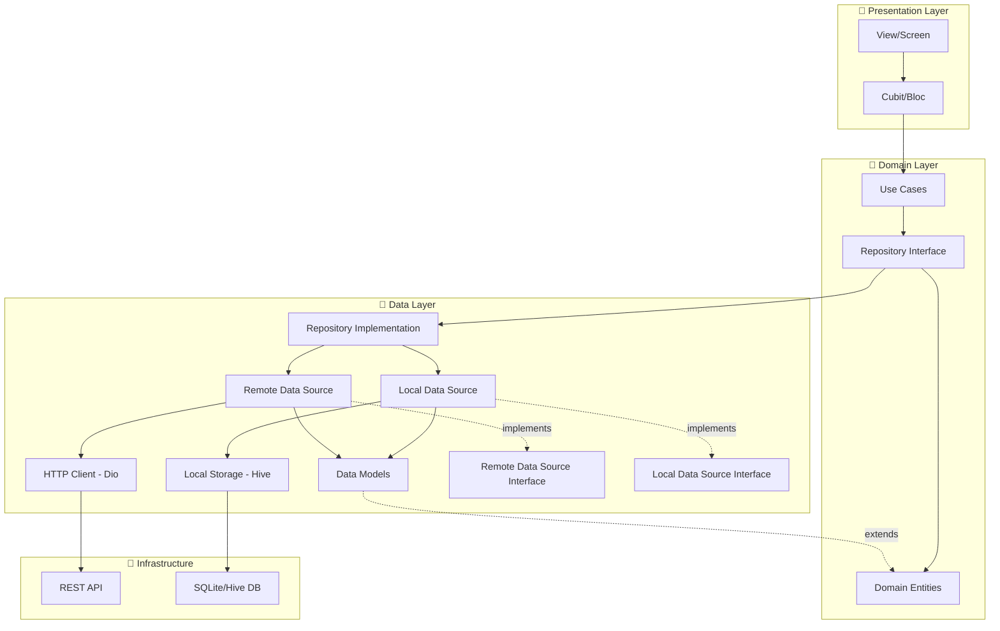
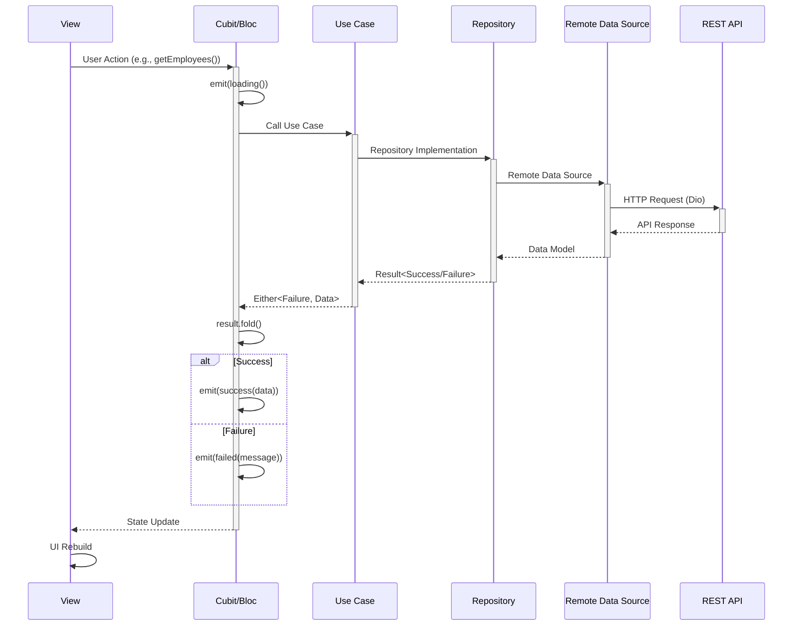
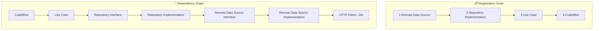
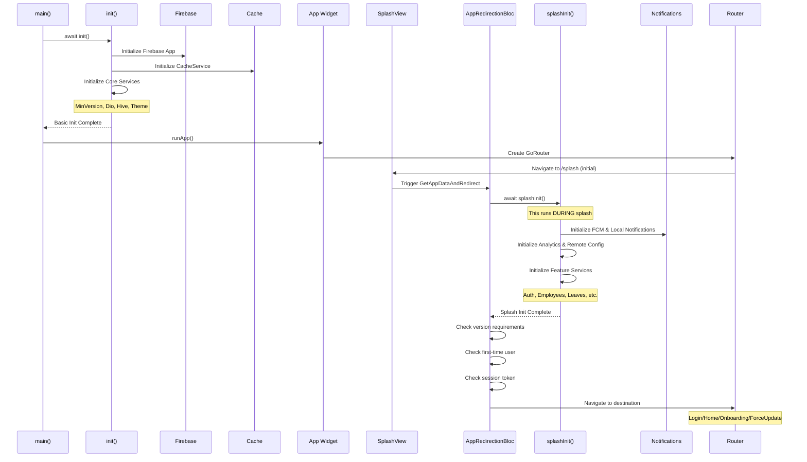
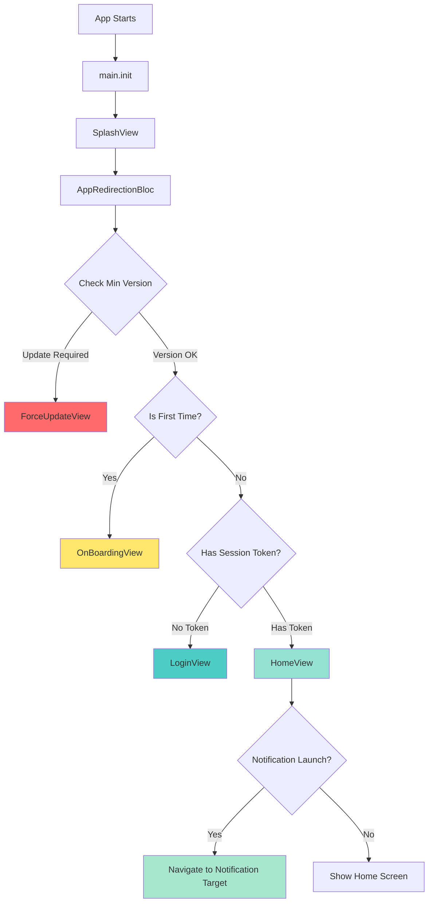
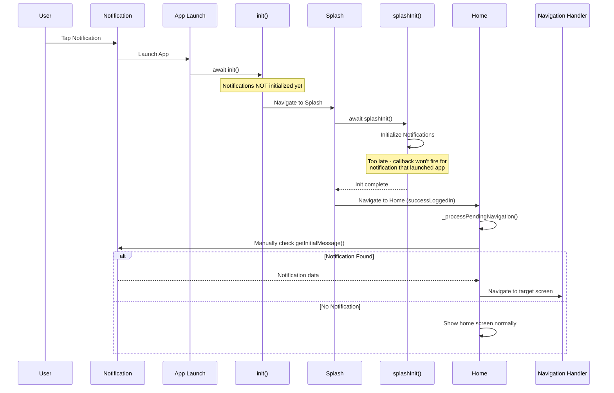
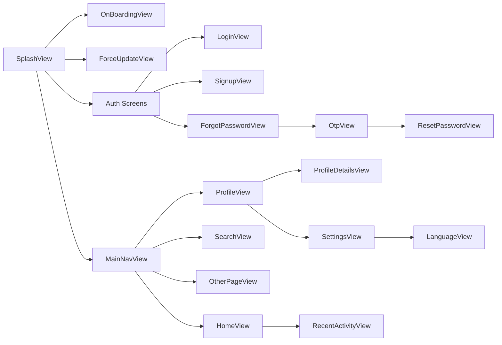

## 🏃‍♂️  How to Run & Develop
We have two flavors (dev & production) each uses a different set of firebase configuration.
### Run with Flavors
- **Development:**
  ```
   flutter run --flavor dev -t lib/main.dart --debug
   flutter run --flavor production -t lib/main.dart --debug
  
  ```
- **Production:**
  ```
  flutter run --flavor dev -t lib/main.dart --production
  flutter run --flavor production -t lib/main.dart --production


  ```
- **Profile mode:**
  ```
  flutter run --dev --target lib/main_dev.dart --flavor profile
  flutter run --production --target lib/main_dev.dart --flavor profile
  ```

### Generate Hive & Freezed Bloc Models
```
flutter packages pub run build_runner build --delete-conflicting-outputs
```

### Generate Localizations
```
flutter gen-l10n
```
--- 

## 🏗️ DDD Architecture Structure




## 🔄 Data Flow Process




---

## 🚀 Dependency Injection Flow



---

## 🚦 App Start & Splash Navigation Flow

The app uses a sophisticated initialization and navigation flow managed by `SplashView` and `AppRedirectionBloc`. Understanding this flow is crucial for debugging and extending the application.

### Initialization Sequence



### Navigation Decision Tree



### Splash Navigation Routes

The `AppRedirectionBloc` evaluates conditions and emits states that trigger navigation:

| Condition | State Emitted | Destination | Path |
|-----------|---------------|-------------|------|
| **Force Update Required** | `successForceUpdate()` | Force Update Screen | `/force-update` |
| **First Time User** | `successOnboarding()` | Onboarding | `/onboarding` |
| **No Session Token** | `successNotLoggedIn()` | Login Screen | `/login` |
| **Has Session Token** | `successLoggedIn()` | Home Screen | `/home` |
| **Version Check Failed** | `failed(message)` | Error State | Stays on `/splash` |

### Implementation Details

#### 1. Main Initialization (`main.dart`)

```dart
void main() async {
  WidgetsFlutterBinding.ensureInitialized();

  // Core initialization (Firebase, Basic Services)
  await init();  // From injection_container.dart

  runApp(MyApp());
}
```

**What happens in `init()`:**
- ✅ Initialize Firebase App
- ✅ Initialize CacheService (SharedPreferences)
- ✅ Initialize core services (HiveDataService, ThemeConfigService, FirebaseRemoteConfigService registration)
- ✅ Initialize MinVersion check components
- ✅ Setup Dio HTTP client
- ❌ **NOT initialized yet:** FCM, Analytics, Feature Services

#### 2. Splash Initialization (`injection_container.main.dart:splashInit()`)

```dart
Future<void> splashInit() async {
  final String organizationId = await sl<CacheService>().getOrganizationId();

  // Parallel initialization of critical services
  await Future.wait([
    MyFirebaseMessagingService.initNotifications(),    // FCM + Local Notifications
    FirebaseAnalyticsEngineService.to.init(),          // Analytics
    sl<FirebaseRemoteConfigService>().initialize(      // Remote Config
      organizationId: organizationId,
    ),
  ]);

  // Parallel initialization of feature services
  await Future.wait([
    _controllersInit(),              // Biometric, Security controllers
    sl<ThemeConfigService>().initialize(),
    _employeesInit(),               // Employee repos, use cases
    _profileInit(),                 // Profile cubit & services
    _authInit(),                    // Auth services
    _leavesInit(),                  // Leave management
    _aiChatInit(),                  // AI chat services
    _attendanceLocationsInit(),     // Location management
    _departmentsInit(),             // Department services
    _roleManagementInit(),          // Role services
    _userManagementInit(),          // User management
    _justificationInit(),           // Justification services
    _employeesAttendanceHistoryInit(),
    _attendanceHistoryInit(),
    _checkInInit(),                 // Check-in/out, break services
    _activityInit(),                // Activity services
  ]);
}
```

**Called from:** `AppRedirectionBloc._getAppDataAndRedirect()` **AFTER** splash screen is shown.

**Why delayed initialization?**
- ⚡ Faster app startup (splash appears quickly)
- 🔐 Requires organizationId from cache (needs user context)
- 📦 Heavy services loaded in background while checking version/auth
- 🚫 Not needed for initial navigation decisions

#### 3. Navigation Logic (`app_redirection_bloc.dart`)

```dart
Future<void> _getAppDataAndRedirect(event, emit) async {
  // Step 1: Check if first time user
  final bool isFirstTime = _cacheService.isFirstTime();

  // Step 2: Initialize remaining services
  await fetchData(); // Calls splashInit()

  // Step 3: Check app version
  final MinVersionForceUpdate minVersion = await checkAppVersion();

  // Step 4: Navigate based on conditions
  switch (minVersion) {
    case MinVersionForceUpdate.update:
      emit(AppRedirectionState.successForceUpdate());

    case MinVersionForceUpdate.okay:
      if (isFirstTime) {
        emit(AppRedirectionState.successOnboarding());
      } else {
        final String? sessionToken = await _cacheService.getSessionToken();
        if (sessionToken == null) {
          emit(AppRedirectionState.successNotLoggedIn());
        } else {
          emit(AppRedirectionState.successLoggedIn());
        }
      }

    case MinVersionForceUpdate.couldNotFetch:
      emit(AppRedirectionState.failed(message: ""));
  }
}
```

#### 4. Splash View Listener (`splash_view.dart`)

```dart
BlocListener<AppRedirectionBloc, AppRedirectionState>(
  listener: (context, state) {
    state.whenOrNull(
      successForceUpdate: () {
        router.go(ForceUpdateView.name);
      },
      successLoggedIn: () {
        router.go(HomeView.name);
        _processPendingNavigation(); // Check for notification launch
      },
      successNotLoggedIn: () {
        router.go(LoginView.name);
      },
      successOnboarding: () {
        router.go(OnBoardingView.name);
      },
      failed: (message) {
        // Show error, stay on splash
      },
    );
  },
)
```

### Notification Deep Linking

When the app is launched from a notification tap (terminated state):



**Why Manual Check is Required:**
- ⚠️ Notifications are initialized in `splashInit()`, which runs **AFTER** the app has already launched
- ⚠️ The notification callback handlers register too late to catch the initial tap
- ✅ Solution: Manually check `getInitialMessage()` and `getNotificationAppLaunchDetails()` after navigation

**Notification Check Priority:**
1. Check FCM `getInitialMessage()` for remote notifications (manual check in splash)
2. Check Local `getNotificationAppLaunchDetails()` for scheduled notifications (manual check in splash)
3. Check stored pending navigation (fallback, rarely used)

### Cache Keys Used

| Key | Purpose | Type | Set When | Read When |
|-----|---------|------|----------|-----------|
| `isFirstTime` | Track first app launch | `bool` | First `init()` | Every splash load |
| `sessionToken` | JWT auth token | `String?` | Successful login | Every splash load |
| `organizationId` | Company/org identifier | `String` | Login/signup | Remote config init |
| `userId` | Current user ID | `String` | Login response | Profile loading |

### Version Check Flow

```dart
// app_redirection_bloc.dart
Future<MinVersionForceUpdate> checkAppVersion() async {
  final packageInfo = await PackageInfo.fromPlatform();
  final currentVersion = packageInfo.version; // e.g., "1.2.3"

  final result = await _getMinVersionUseCase();

  return result.fold(
    (failure) => MinVersionForceUpdate.couldNotFetch,
    (minVersion) {
      if (_compareVersions(currentVersion, minVersion) < 0) {
        return MinVersionForceUpdate.update;
      }
      return MinVersionForceUpdate.okay;
    },
  );
}
```

**Version Comparison:**
- Fetches minimum required version from backend
- Compares with current app version
- Forces update if current < minimum

### Common Scenarios

#### Scenario 1: First Time User
```
App Launch → Splash → Check first time (true) → Onboarding → Manual nav to Login
```

#### Scenario 2: Returning User (Logged Out)
```
App Launch → Splash → Check token (null) → Login Screen
```

#### Scenario 3: Returning User (Logged In)
```
App Launch → Splash → Check token (exists) → Home Screen
```

#### Scenario 4: Outdated App Version
```
App Launch → Splash → Version check (outdated) → Force Update Screen (BLOCKS ALL NAVIGATION)
```

#### Scenario 5: Notification Launch
```
Notification Tap → App Launch → Splash → Home → Check notification → Navigate to Target
```

### Debugging Tips

**1. Check initialization logs:**
```dart
🚀 Starting of something great!
✅ All Main Services initialized
[App launches, splash shows, splashInit() starts]
🔔 [DEBUG] initNotifications() START
✅ NotificationService initialized
✅ All Services initialized
```

**Important:** Notice that `initNotifications()` happens **AFTER** "All Main Services initialized". This is why notification callbacks don't fire for terminated state launches - they register too late!

**2. Track navigation flow:**
```dart
PUSHED route: /splash
PUSHED route: /home
```

**3. Monitor bloc states:**
```dart
// In splash view, add logging:
BlocListener<AppRedirectionBloc, AppRedirectionState>(
  listener: (context, state) {
    UtilFunctions.appLog("🔄 Splash state: $state");
    // ... navigation logic
  },
)
```

**4. Verify cache values:**
```dart
// In AppRedirectionBloc:
UtilFunctions.appLog("Is first time: $isFirstTime");
UtilFunctions.appLog("Session token: ${sessionToken != null}");
```

### Error Handling

| Error Type | Behavior | Recovery |
|-----------|----------|----------|
| Version check network failure | Show error, stay on splash | User can retry or close app |
| Service init failure | Log error, continue with available services | Graceful degradation |
| Navigation failure | Log error, fallback to login | Clear cache if persistent |
| Token validation failure | Treat as logged out | Redirect to login |

### Testing Navigation Flow

**Manual Test Cases:**

1. **Fresh Install:**
    - Clear app data
    - Launch app
    - Should show onboarding

2. **Logged Out User:**
    - Clear session token
    - Launch app
    - Should show login

3. **Logged In User:**
    - Ensure valid token in cache
    - Launch app
    - Should show home

4. **Force Update:**
    - Downgrade app version (or mock API response)
    - Launch app
    - Should show force update

5. **Notification Launch:**
    - Schedule notification
    - Kill app
    - Tap notification
    - Should open app → home → navigate to target

---

## Pages Structure




---
## Notes:
###Packages

---


<p align="center"><b>Made with ❤️ using Flutter</b></p> 
